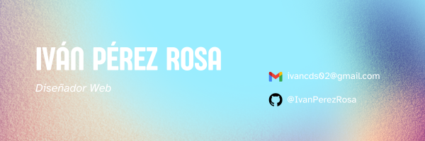

### Hola buenas, Soy Ivan👋

Soy Iván, un estudiante de Desarrollo de Aplicaciones Web, actualmente estoy en Primer año y estoy con muchas ganas de aprender más sobre este mundillo.

Estos son los Lenguajes que uso actualmente:
- Java
- JavaScript
- HTML
- CSS
- MySQL
- C++

<!--
**IvanPerezRosa/IvanPerezRosa** is a ✨ _special_ ✨ repository because its `README.md` (this file) appears on your GitHub profile.

Here are some ideas to get you started:

- 🔭 I’m currently working on ...
- 🌱 I’m currently learning ...
- 👯 I’m looking to collaborate on ...
- 🤔 I’m looking for help with ...
- 💬 Ask me about ...
- 📫 How to reach me: ...
- 😄 Pronouns: ...
- ⚡ Fun fact: ...
-->
